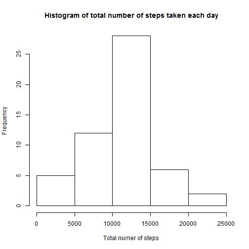
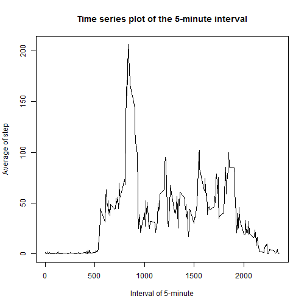
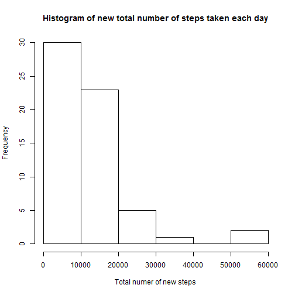
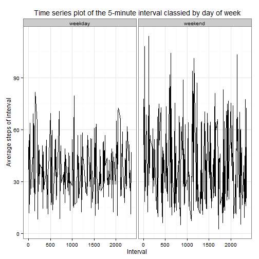

## Loading and preprocessing the data

```r
library(dplyr) ##using for summary parts later
library(ggplot2) ##using for plot graphs later
library(chron) ##using for determine weekend or weekday
##read the csv file into dataset
activity <- read.csv("activity.csv")
activity <- tbl_df(activity)
```

## What is mean total number of steps taken per day?
###1. Calculate the total number of steps taken per day

```r
##Because all missing values are ignored, some of days may not have any data.
##Therefore, I filter the total of steps, which are greater than 0.
group_day <- group_by(activity, date) %>%
  summarise(total = sum(steps, na.rm = T)) %>%
  filter(total > 0)
print(group_day)
```

```
## Source: local data frame [53 x 2]
## 
##          date total
##        (fctr) (int)
## 1  2012-10-02   126
## 2  2012-10-03 11352
## 3  2012-10-04 12116
## 4  2012-10-05 13294
## 5  2012-10-06 15420
## 6  2012-10-07 11015
## 7  2012-10-09 12811
## 8  2012-10-10  9900
## 9  2012-10-11 10304
## 10 2012-10-12 17382
## ..        ...   ...
```
###2. Make a histogram of the total number of steps taken each day

```r
hist(group_day$total, main = "Histogram of total number of steps taken each day", xlab = "Total numer of steps")
```

 

###3. Calculate and report the mean and median of the total number of steps taken per day.

```r
summary(group_day$total)
```

```
##    Min. 1st Qu.  Median    Mean 3rd Qu.    Max. 
##      41    8841   10760   10770   13290   21190
```

## What is the average daily activity pattern?
###1. Make a time series plot

```r
##Group by interval, calculate mean of steps, ignore all missing values.
##similarity, only get the result greater than 0
group_interval <- group_by(activity, interval) %>%
  summarise(average = mean(steps, na.rm = T)) %>%
  filter(average > 0)
##creating time series
plot(x = group_interval$interval, y = group_interval$average, type = "l", main = "Time series plot of the 5-minute interval", ylab = "Average of step", xlab = "Interval of 5-minute")
```

 

###2. Indicating the peak of steps across all intervals

```r
##figure out the maximum of average steps across all intervals
max(group_interval$average)
```

```
## [1] 206.1698
```

```r
##get the interval along with the average steps
arrange(group_interval, desc(average)) %>%
  slice(1)
```

```
## Source: local data frame [1 x 2]
## 
##   interval  average
##      (int)    (dbl)
## 1      835 206.1698
```

## Imputing missing values
###1. Calculate and report the total number of missing values in the dataset
####1.1. Total missing value in activity dataset

```r
##calculate all missing value in the datasets
missing_values <- filter(activity, is.na(steps))
nrow(missing_values)
```

```
## [1] 2304
```
####1.2. Total missing value per day

```r
mutate(missing_values, isMissing = is.na(steps)) %>%
  group_by(date) %>%
  summarise(Total.Missing = sum(isMissing))
```

```
## Source: local data frame [8 x 2]
## 
##         date Total.Missing
##       (fctr)         (int)
## 1 2012-10-01           288
## 2 2012-10-08           288
## 3 2012-11-01           288
## 4 2012-11-04           288
## 5 2012-11-09           288
## 6 2012-11-10           288
## 7 2012-11-14           288
## 8 2012-11-30           288
```
###2 & 3. Filling the missing values

```r
######If there is no data of steps for any intervals, 
######I'll take the average of steps of the intervals. 
######In another words, missing value of steps of certain interval 
######will be equal to the average of steps of that interval.
##1st. split the dataset into small chunks by interval
interval.activity <- split(x = activity, f = activity$interval)
##2nd: loop all interval
filled_activity <- data.frame()
for (i in 1:length(interval.activity))
{
  ##3rd: determine the mean of steps for each interval
  ave_steps <- mean(interval.activity[[i]]$steps, na.rm = T)
  ##4th: indicate the position of each missing values
  missing_possition <- which(is.na(interval.activity[[i]]$steps))
  ##5th: assigning all missing values to the mean of steps at 3rd step
  interval.activity[[i]]$steps[missing_possition] <- ave_steps
  ##6th: rbind all datasets to create a new dataset
  filled_activity <- rbind(filled_activity, interval.activity[[i]])
}
##I don't want to see the variable i in my list of variable
rm(i)
##7h: create a new column in activity dataset. That column contains the steps data in filled_activity dataset
activity <- mutate(activity, filled_steps = steps)
activity$filled_steps <- filled_activity$steps
```
###4. Make histogram and report mean and median of new filled dataset
####4.1 Make histogram

```r
filled_group_day <- group_by(activity, date) %>%
  summarise(total = sum(filled_steps))
hist(filled_group_day$total, main = "Histogram of new total number of steps taken each day", xlab = "Total numer of new steps")
```

 

####4.2 Report summary

```r
summary(filled_group_day$total)
```

```
##     Min.  1st Qu.   Median     Mean  3rd Qu.     Max. 
##    21.87   727.70 10310.00 10770.00 15020.00 50820.00
```

```r
####AS we can see the huge difference between the new histogram and the old histograms
####as well asl the difference between the old summary and the new summary.
####For the histogram, the peak of the histogram shifts from 10000-15000 steps to 0-10000steps.
####Besides, there are upto 25000 steps in the old histograp, while it expands to 60000 steps in the new histogray
####For the summary, the mean remain the same as 10770 while there is a slightly change in median.
```
## Are there differences in activity patterns between weekdays and weekends?
###1. Create a new factor variable to indicate weekend or weekday

```r
new_activity <- mutate(activity, day=ifelse(is.weekend(as.Date(date)), "weekend", "weekday")) %>%
  group_by(day, interval) %>%
  summarise(average = mean(filled_steps))
```
###2. Make a time series of the average steps of each intervals per weekday and weekend

```r
ggg <- ggplot(data = new_activity, aes(interval, average),  fill=day) +
  geom_line(stat = "identity") +
  theme_bw() + guides(fill=FALSE)+
  facet_grid(.~day, scales = "free", space="free") + 
  labs(x="Interval", y=expression("Average steps of interval")) + 
  labs(title=expression("Time series plot of the 5-minute interval classied by day of week"))
print(ggg)
```

 
